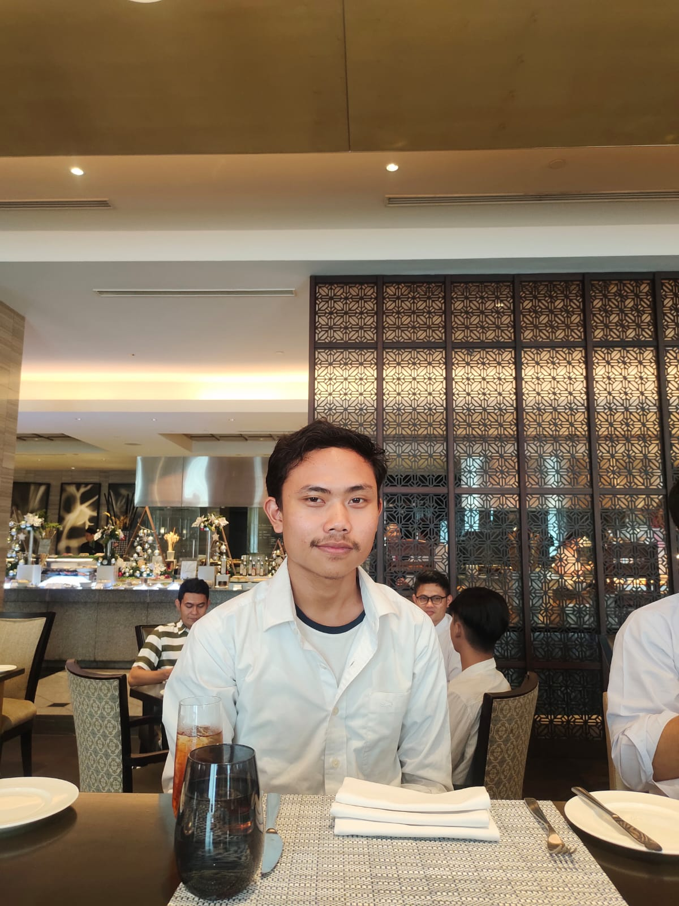

<!DOCTYPE html>
<html lang="en">
<head>
    <meta charset="UTF-8">
    <meta name="viewport" content="width=device-width, initial-scale=1.0">
    <title>Profil dan Kontak</title>
    
</head>
<body>
    

    <li class="li-navbar">
        <a href="Websitepromosi.html" class="a-navbar">Home</a></li>

    

        <h1>Profil dan Kontak</h1>
        

            
            <h2>Arya Syaputra</h2>
            
NIM : 211011450482

            
Kelas : 05 TPLE 002

            
        

        

            <h2>Kontak</h2>
            <ul class="contact-list">
                <li class="contact-item">
                    <h3>Email:</h3>
                    
aryasaputra1306@email.com

                </li>
                <li class="contact-item">
                    <h3>WhatsApp:</h3>
                    
<a href="https://wa.me/6289507946724">+62 895-0794-6724</a>

                </li>
            </ul>
        

        

            <h2>Sosial Media</h2>
            

                
<a href="https://www.instagram.com/arrst.8/">instagram</a>

                
<a href="https://twitter.com/arvns8">x</a>

            

        

    

</body>
</html>
<!DOCTYPE html>
<html lang="en">
<head>
    <title> Gaalery</title>
    <meta charset="UTF-8">
    <meta name="viewport" content="width=device-width, initial-scale=1.0">
    <link rel="stylesheet" href="style.css" />
</head>

<body>
    <!-- Navigation Bar-->
    

        <ul class="ul-navbar">
        <li class="li-navbar">
            <a href="Websitepromosi.html" class="a-navbar">Home</a></li>
        <li class="li-navbar">
            <a href="Wisata.html" class="a-navbar">Wisata</a></li>
        <li class="li-navbar">
            <a href="galery.html" class="a-navbar">Galery</a></li>
        <li class="li-navbar">
            <a href="contact.html" class="a-navbar">Contact</a></li>
    </ul>
    

    

        <video controls src="TrailerKarimun.mp4">video</video>
     

        
</body>
</html>
<!DOCTYPE html>
<html lang="en">
<head>
    <title> Website Promosi KarimunJawa</title>
    <meta charset="UTF-8">
    <meta name="viewport" content="width=device-width, initial-scale=1.0">
    <link rel="stylesheet" href="style.css" />
</head>

<body>
    <!-- Navigation Bar-->
    

        <ul class="ul-navbar">
        <li class="li-navbar">
            <a href="#" class="a-navbar">Home</a></li>
        <li class="li-navbar">
            <a href="Wisata.html" class="a-navbar">Wisata</a></li>
        <li class="li-navbar">
            <a href="galery.html" class="a-navbar">Galery</a></li>
        <li class="li-navbar">
            <a href="contact.html" class="a-navbar">Contact</a></li>
    </ul>
    

    

        
    

    
    <h2>Destinasi Wisata</h2>
        
Beberapa destinasi wisata terkenal di Pulau Karimunjawa antara lain:

        <ul class="penjelasan">
            <li>Pulau Menjangan Kecil</li>
            <li>Pulau Cemara Kecil</li>
            <li>Pulau Geleang</li>
            <li>Pulau Kemujan</li>
            <li>Pulau Karimunjawa</li>
        </ul>

        <h2>Aktivitas Wisata</h2>
        
Para pengunjung dapat menikmati berbagai aktivitas di Pulau Karimunjawa, seperti:

        <ul class="penjelasan">
            <li>Snorkeling dan diving untuk menikmati keindahan terumbu karang dan biota laut.</li>
            <li>Berlayar dan menjelajahi pulau-pulau kecil sekitarnya.</li>
            <li>Menyaksikan sunset di salah satu pantai yang indah.</li>
            <li>Memancing di laut sekitar Pulau Karimunjawa.</li>
            <li>Menikmati kuliner khas Karimunjawa seperti ikan bakar dan seafood segar.</li>
        </ul>

        <h2>Akomodasi</h2>
        
Di Pulau Karimunjawa, terdapat berbagai pilihan akomodasi mulai dari penginapan murah hingga resort mewah yang menawarkan fasilitas lengkap untuk para wisatawan.

        
Jadi, jika Anda mencari destinasi wisata yang menawarkan keindahan alam bawah laut yang memesona dan suasana pulau yang tenang, Pulau Karimunjawa adalah pilihan yang sempurna untuk Anda.

        
</body>
</html>
<!DOCTYPE html>
<html lang="en">
<head>
    <title> Daftar Wisata</title>
    <meta charset="UTF-8">
    <meta name="viewport" content="width=device-width, initial-scale=1.0">
    <link rel="stylesheet" href="style.css" />
</head>

<body>
    <!-- Navigation Bar-->
    

        <ul class="ul-navbar">
        <li class="li-navbar">
            <a href="Websitepromosi.html" class="a-navbar">Home</a></li>
        <li class="li-navbar">
            <a href="Wisata.html" class="a-navbar">Wisata</a></li>
        <li class="li-navbar">
            <a href="galery.html" class="a-navbar">Galery</a></li>
        <li class="li-navbar">
            <a href="contact.html" class="a-navbar">Contact</a></li>
    </ul>
    

    

          
    

    

        <table border="2" cellpadding="5" cellspacing="5"></table>

       </ul>  
</body>
</html>
